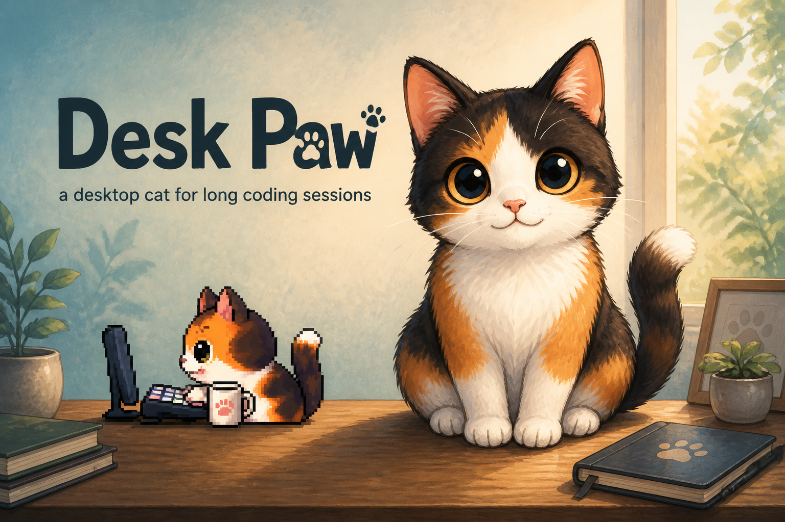

# Desk Paw

[](https://klockitier.github.io/desk-paw/)

**[Homepage →](https://klockitier.github.io/desk-paw/)**

A tiny open-source macOS desktop cat.

It floats above your desktop, reacts to the mouse and keyboard, and can be steered by local agent hooks (`pawctl`). Inspired by the *idea* of desktop companions — **all artwork, animations, branding, and code here are original**.

## Download

Install in one step (downloads the right Mac build, puts it in Applications, and
clears the Gatekeeper quarantine so it opens):

```bash
bash -c "$(curl -fsSL https://raw.githubusercontent.com/klockitier/desk-paw/main/install.sh)"
```

Or grab a `.dmg` from **[Releases](https://github.com/klockitier/desk-paw/releases/latest)** and drag it into Applications yourself. Unsigned builds need a one-time quarantine clear — the script above does that for you.

Optional after install: allow Accessibility / Input Monitoring if you want the cat to notice typing across other apps.

Prefer building from source? Jump to [Install](#install).

## Why

Coding agents and long desktop sessions feel more alive with a small companion that notices when you type, when you wait, and when something finishes. This MVP is intentionally minimal so the behavior loop is easy to extend.

## Requirements

- macOS
- [Node.js](https://nodejs.org/) 20+
- [Rust](https://www.rust-lang.org/tools/install) (stable)
- Xcode Command Line Tools

## Install

For a ready-made app, use [Download](#download). To develop or build yourself:

```bash
git clone https://github.com/klockitier/desk-paw.git
cd desk-paw
npm install
```

## Run locally

```bash
npm run tauri dev
```

The cat window should appear without normal chrome. Right-click the cat for **Quit**.

Production-ish build:

```bash
npm run tauri build
```

## macOS permissions

| Feature | Permission | Required? |
| --- | --- | --- |
| Transparent always-on-top window | None | — |
| Drag cat / click / local reactions | None | — |
| Eyes follow cursor **inside** the pet window | None | — |
| Eyes follow cursor **across the desktop** | Accessibility (and sometimes Input Monitoring) | Optional |
| Detect typing in other apps | Accessibility / Input Monitoring | Optional |

If global monitoring is denied, the app still works: local mouse-over, click-to-pet, drag, and `pawctl` events keep functioning. A short on-screen note explains how to enable the permission.

**Privacy:** the app only learns that *a key event happened*. It does **not** read, store, log, or transmit which keys were pressed.

Enable via:

**System Settings → Privacy & Security → Accessibility** (allow **Desk Paw** / `desk-paw`).  
If needed, also check **Input Monitoring**.

## Architecture

```text
┌─────────────────────────────────────────────┐
│ Frontend (Vite + TS)                        │
│  state.ts        → central state machine    │
│  main.ts         → drag, events, persist    │
│  cats/walker-cat → sprite-sheet cat         │
│  cats/sprites.ts → frame loading / lookup   │
│  styles.css      → original CSS pixel cat   │
│  sound.ts        → no-op hooks for SFX      │
└─────────────────┬───────────────────────────┘
                  │ Tauri events / commands
┌─────────────────▼───────────────────────────┐
│ Rust (Tauri 2)                              │
│  transparent accessory window               │
│  CGEvent input monitor (activity only)      │
│  localhost pawctl TCP server :19283         │
└─────────────────────────────────────────────┘
```

## Cat artwork

The walker cat renders pre-rendered frames from `src/assets/cat/`. Each animation
exists in three views — `front`, `left`, `right` — so the cat keeps the same
identity whichever way it faces:

| Animation | Frames (front / left / right) |
| --- | --- |
| `idle` | 6 / 4 / 4 |
| `walk` | 5 / 4 / 4 |
| `run` | 5 / 4 / 4 |
| `sit` | 3 / 3 / 3 |
| `sleep` | 2 / 1 / 1 |
| `happy` | 2 / 1 / 1 |
| `dragged` | 3 / 3 / 3 |
| `overheated` | 1 / 1 / 1 |
| `jump_up` | 8 / 8 / 8 / 8 (also `back`) |
| `jump_down` | 8 / 8 / 8 / 6 (also `back`) |
| `typing_calm` | 8 / 7 / 7 |
| `typing_aggressive` | 6 / 6 / 6 |
| `typing_exhausted` | 1 / 1 / 1 |

The cat always types in a **side view** — when idle-facing-front, typing uses the
last side it faced.

### Typing intensity

Key **timing** drives the mood; the keys themselves are never read or stored (see
[Privacy](#privacy-guarantees)). `PetStateMachine` keeps a list of timestamps from
the last second:

| Rate | State |
| --- | --- |
| up to 6 keys/sec | `TYPING` (calm) |
| more than 6 keys/sec | `TYPING_AGGRESSIVE` |
| back under 4 keys/sec | `TYPING` again |
| no keys for 1.2s | wind down — rage lands on `EXHAUSTED` for 1.6s first |

Purely speed-driven, in both directions. The enter/exit thresholds differ (6 up, 4
down) so one slow keystroke mid-burst doesn't flip the animation back and forth.
`typingIntensity` (0→1) is exposed on the machine for anything else that wants to
react to pace. Priority is
`ERROR`/`OVERHEATED` → typing → agent state → idle: the cat can type while an agent
is `WORKING` and returns to that state afterwards.

### State machine

States: `IDLE`, `BLINKING`, `WATCHING_CURSOR`, `TYPING`, `TYPING_AGGRESSIVE`, `EXHAUSTED`, `DRAGGED`, `HAPPY`, `SLEEPING`, plus agent states `WORKING`, `WAITING`, `DONE`, `ERROR`, `OVERHEATED`.

All transitions go through `src/state.ts`. Animations only render the current state.

## Trigger cat states

### In the UI

- **Click** the cat → happy
- **Drag** the cat → dragged pose, position saved
- **Right-click** → quick menu (idle / happy / sleep / quit)
- Move the cursor near the cat → watching
- Type (globally if permitted, or while the window is focused) → kneading / typing
- Leave the cat alone ~45s → sleeping

### Via `pawctl`

With the app running:

```bash
npm run pawctl -- working
npm run pawctl -- waiting
npm run pawctl -- done
npm run pawctl -- error
npm run pawctl -- overheated
npm run pawctl -- idle
npm run pawctl -- happy
npm run pawctl -- sleeping
```

Or:

```bash
node pawctl.mjs done
```

Protocol: one line over TCP to `127.0.0.1:19283` (override with `PAWCTL_PORT`).

## AI-agent integrations (later)

Point Claude Code / Codex / Cursor hooks at `pawctl`:

```bash
# example: when an agent starts a task
node /path/to/desk-paw/pawctl.mjs working

# when it finishes
node /path/to/desk-paw/pawctl.mjs done

# on failure
node /path/to/desk-paw/pawctl.mjs error
```

No cloud API, no accounts — just a local loopback poke.

## Privacy guarantees

- No analytics
- No telemetry
- No external network requests from the app
- No cloud services
- Keyboard contents are never collected
- Mouse coordinates are used only for immediate local interaction (eyes / proximity)
- `pawctl` listens on **localhost only**

## Position persistence

Last window position is stored in `localStorage` (`desk-paw.position`) and restored on launch.

## Contributing

1. Keep the MVP spirit: working behavior over polish.
2. Do not add analytics, accounts, or network callers.
3. Do not copy proprietary pet artwork or animations from other apps.
4. Prefer small PRs that extend the state machine or art swap-ins.

```bash
npm run tauri dev
```

## License

MIT — see [LICENSE](./LICENSE).
